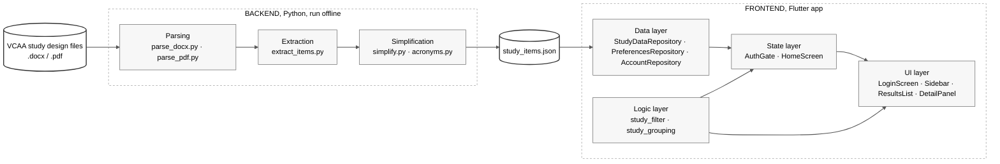

# VCE Unpacked

Flutter desktop app that turns VCE study design documents into a
searchable, plain-language browser: pick a subject, filter by
outcome/key knowledge/key skill/command term, see official wording next
to a plain-language rewrite.

Two parts, connected only by a generated JSON file, the backend never
runs at app runtime:

- **`backend/`**, offline Python pipeline. Converts source
  `.docx`/`.pdf` study design files into `study_items.json`. Run
  manually. See [backend/README.md](backend/README.md).
- **`lib/`**, Flutter app. Shows a fully local login screen, then reads
  the bundled `study_items.json` at startup.

## Architecture



The two sides never talk to each other directly, `study_items.json` is
the entire interface. The backend doesn't run when the app runs, and
the app has no code path back into the backend; it only ever reads
that one file, once, at startup.

Inside the backend pipeline:

1. `parse_docx.py` / `parse_pdf.py`, source file → `RawBlock` list (text + heading level).
2. `extract_items.py`, `RawBlock` list → `StudyItem` list (Outcome / Key Knowledge / Key Skill / Command Term).
3. `simplify.py`, fills in `plain_language_text` (TF-IDF extraction + jargon substitution + spaCy clause splitting).
4. `acronyms.py`, expands bare acronyms using definitions found elsewhere in the same subject.
5. `attach_shared_glossary` (in `extract_items.py`), copies the shared VCAA command-term
   glossary (`source_docs/GlossaryOfCommandTerms.docx`) onto every subject whose study design
   has no embedded glossary, so the Command Term filter works for all 12 subjects.
6. `build.py`, writes the combined result to `output/study_items.json`.
7. Copy that file over `assets/data/study_items.json` (manual step) and the Flutter app picks it up at next launch.

No LLM, no API calls anywhere in the backend, nltk (sentence
tokenization), scikit-learn (TF-IDF/cosine similarity) and spaCy
(`en_core_web_sm`, a small statistical parser) only. Full explanation
of each stage, known limitations, and fixed bugs is in
[backend/README.md](backend/README.md).

To refresh the dataset after adding/updating source files:

```bash
cd backend && source .venv/bin/activate && python -m ingest.build
cd .. && cp backend/output/study_items.json assets/data/study_items.json
```

That copy is the whole interface between the two halves and is easy to
forget, the app then ships stale content with no warning. After
re-running the pipeline, verify the two files are in sync:

```bash
diff -q backend/output/study_items.json assets/data/study_items.json
```

## Features

- **Local login**, every launch shows a fully local account picker
  (no network). Two demo accounts are seeded automatically on first
  use. Tap your icon, enter your password, and go.
- **Subject selection**, each user chooses their own subset of
  subjects at account creation, and can change them at any time from
  Settings.
- **Subject sidebar**, derived from the logged-in user's chosen
  subjects, not from the full dataset.
- **Search**, full-text, across title/official text/plain-language
  text, debounced 200ms.
- **Category filter**, segmented control (Outcome / Key Knowledge /
  Key Skill / Command Term); pills are derived from the selected
  subject's data, and Command Term data exists for every subject, from
  the study design's embedded glossary where it has one, otherwise from
  the shared VCAA command-term glossary.
- **Grouped results list**, Unit → Area of Study headers, natural
  reading order; category-colored accent per card; `ListView.builder`
  so only visible cards get built.
- **Detail panel**, official text + plain-language rewrite side by
  side; shows a note instead of a duplicate when there's nothing to
  simplify; toggle to mark an item complete.
- **Per-account completion tracking**, each user's completed items
  are persisted independently under `SharedPreferences`, scoped by
  username.
- **Light/dark theme**, global device preference, persisted via
  `SharedPreferences`.

### How accounts & logins are stored

Everything is **local to the device**, there is no server, no network,
and no cloud. Accounts live in `SharedPreferences` as one JSON blob under
the key `user_accounts`:

- Passwords are **never stored in plaintext**. On account creation a
  random 16-byte salt is generated per account and the password is stored
  as a SHA-256 hash of `salt:password`. Login re-hashes the typed
  password with that account's salt and compares hashes.
- The active login session is **in-memory only**, reopening the app
  always returns to the login screen, since nothing marks you as "logged
  in" between launches.
- Completion marks are stored separately per account, keyed
  `completed_item_ids_<username>`.
- On a Mac, the store is the app's `SharedPreferences` plist under
  `~/Library/Preferences/` (readable by anyone with access to the
  machine), so the salt + hash matters.

**The honest bit:** this is a simple local login for a classroom tool,
passwords are scrambled (hashed), not saved as plain text, but this
isn't the level of security a bank or website would use. And since only
the scrambled version is stored, a forgotten password can't be recovered
or reset from inside the app.

## Project structure

```
lib/
├── main.dart                        # App entry point, theme wiring, AuthGate
├── models/
│   ├── study_item.dart              # StudyItem data model + fromJson
│   └── user_account.dart            # UserAccount data model + fromJson/copyWith
├── logic/
│   ├── study_filter.dart            # Pure three-axis filter (subject, category, search)
│   └── study_grouping.dart          # Results-list row grouping (Unit/AoS/Glossary) + card headlines
├── data/
│   ├── study_data_repository.dart   # Loads assets/data/study_items.json
│   ├── preferences_repository.dart  # Per-account completion status + global dark mode
│   └── account_repository.dart      # Local accounts, SHA-256 password hashing, demo defaults
├── theme/
│   ├── app_colors.dart              # Light/dark color tokens
│   ├── category_colors.dart         # Per-category accent colors
│   └── theme_model.dart             # ChangeNotifier for theme state
├── screens/
│   ├── login_screen.dart            # Every-launch account picker + password gate
│   ├── account_setup_screen.dart    # Name + password + emoji, routes to subject selection
│   ├── subject_selection_screen.dart# Reusable multi-select subject checklist
│   └── home_screen.dart             # Three-pane layout, state, filter wiring
└── widgets/
    ├── sidebar.dart                  # Subject list
    ├── search_bar_widget.dart
    ├── category_tabs.dart            # Segmented-control category filter
    ├── results_list.dart             # Grouped, filtered result cards (ListView.builder)
    ├── detail_panel.dart             # Selected item detail view
    ├── settings_slideout.dart        # User info, subject editing, log out, theme toggle
    └── loading_screen.dart           # Startup loading state
assets/data/
└── study_items.json                 # Generated dataset (copied from backend/output/)
backend/
├── ingest/
│   ├── models.py                    # RawBlock / StudyItem dataclasses
│   ├── heading_patterns.py          # VCAA heading regexes, glossary-table filtering
│   ├── parse_docx.py                # .docx -> RawBlock list
│   ├── parse_pdf.py                 # .pdf -> RawBlock list
│   ├── extract_items.py             # RawBlock list -> StudyItem list
│   ├── simplify.py                  # official_text -> plain_language_text
│   ├── jargon_dictionary.json       # word/phrase -> plain-language map
│   ├── acronyms.py                  # cross-item acronym expansion
│   └── build.py                     # CLI entry point
├── scripts/
│   └── analyze_vocabulary.py        # jargon dictionary authoring aid
├── source_docs/                     # .docx/.pdf study design files (gitignored)
└── output/study_items.json          # Pipeline output
```

## Language notes

Dart has no `public`/`private`/`protected` keywords. Its access
modifier is a naming convention: a leading underscore (`_isDark`,
`_HomeScreenState`, `_applyFilters`) makes a member private to its own
library (file); everything else is public by default. Used
consistently throughout `lib/`, see
[theme_model.dart](lib/theme/theme_model.dart) for a concrete example
(private `_isDark` field, exposed only via a read-only `isDark` getter
and a `toggleTheme()` method).

## Current state

- Dataset: 2,579 items across 12 subjects (Applied Computing, Business
  Management, Data Analytics, English EAL, Foundation Mathematics,
  General Mathematics, Mathematical Methods, Media, Philosophy,
  Physics, Software Development, Specialist Mathematics), generated
  from 7 real VCAA study design files plus the shared VCAA command-term
  glossary (95 Outcomes, 1,201 Key Knowledge, 813 Key Skill, 470
  Command Term). Every subject has Command Term data, its own embedded
  glossary where the study design has one, otherwise the shared one.
- Category pills (Outcome / Key Knowledge / Key Skill / Command Term)
  are derived from each selected subject's data, not hardcoded;
  switching subject resets the filter when the previous category
  doesn't exist for it.
- Login is fully local/offline. The first launch seeds two demo
  accounts: `Demo Student` / `demo123` and `Demo Friend` / `friend123`.
  User accounts store a salted SHA-256 password hash, emoji icon, and
  chosen subject list in `SharedPreferences`.
- Completion status persists per account via `PreferencesRepository`;
  dark mode is a global device preference. The active login session is
  only in memory, so reopening the app always returns to the login
  screen.
- Three-column desktop layout (220px sidebar, 35%-width detail panel)
  with responsive breakpoints: the sidebar drops below 700px and the
  detail panel below 980px. Built desktop-first; no touch/gesture
  adaptations for phones.
- Plain-language rewrites are rule-based (extractive + substitution +
  clause-splitting), not true paraphrasing, see
  [backend/README.md](backend/README.md) for known limitations.

## Getting started

### Run the app

Requires the [Flutter SDK](https://docs.flutter.dev/get-started/install)
(Dart SDK `^3.7.2`, per `pubspec.yaml`).

```bash
flutter pub get
flutter run
```

Scaffolding is included for macOS and Windows only, the two desktop
platforms the app targets. `flutter devices` to list targets, then
`flutter run -d macos` / `-d windows` to pick one.

Removed platforms (Android/iOS/Linux/web) can be regenerated at any time
with `flutter create . --platforms=android,ios,linux,web`.

### Run the backend pipeline

The app works out of the box without this, `assets/data/study_items.json`
is already bundled. The backend exists to **regenerate** that dataset from
the raw VCAA study design documents committed under `backend/source_docs/`.
It runs fully offline and never ships with the app.

Copy-paste, from a fresh clone:

```bash
cd backend
python3 -m venv .venv
source .venv/bin/activate            # Windows: .venv\Scripts\activate
pip install -r requirements.txt
python -m spacy download en_core_web_sm
python -m ingest.build
```

That writes `backend/output/study_items.json`. Verify it matches what the
app ships:

```bash
diff -q output/study_items.json ../assets/data/study_items.json
```

Expected result on a fresh clone: 2,579 items across 12 subjects
(95 Outcomes, 1,201 Key Knowledge, 813 Key Skill, 470 Command Term),
byte-identical to the bundled dataset, the pipeline is deterministic
and reproducible. If you change anything, sync the app copy with:

```bash
cp output/study_items.json ../assets/data/study_items.json
```

Details of every stage (parsing, extraction, simplification, acronym
expansion) and known limitations: [backend/README.md](backend/README.md).

### Tests

```bash
flutter test
```
